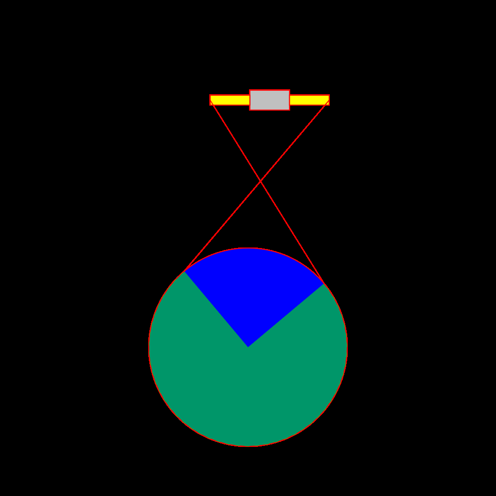

# TEQS.io: Terrain and Environment Quantification Systems

Welcome to **[TEQS.io](https://teqs.io)**, where we specialize in geospatial data science and remote sensing to develop advanced solutions for terrain and environment quantification.

## Our Mission 🌍
At TEQS, our mission is to work on projects with cutting-edge geospatial software, modelling, and data that enable informed decisions about the environment. 

## Products & Services 🛠️
- **ML/AI**: Advanced tools for geospatial analysis and mapping using GeoAI.
- **Ecological Remote Sensing**: Measuring and monitoring ecological parameters using UAV, aerial, and satellite data.
- **UAV Flights**: Custom UAV (rgb/multispectral/thermal) flights for mapping, monitoring, and research.
- **High Performance Computing**: Leveraging powerful computing resources to handle large geospatial datasets and complex computations.
- **Geospatial Data Processing**: Efficient processing and analysis of geospatial data.
- **Custom Software Development**: Tailored solutions to meet specific client requirements.

## Contact Information 📞
For more information, please visit our [website](https://www.teqs.io) or contact us at [info@teqs.io](mailto:info@teqs.io).
